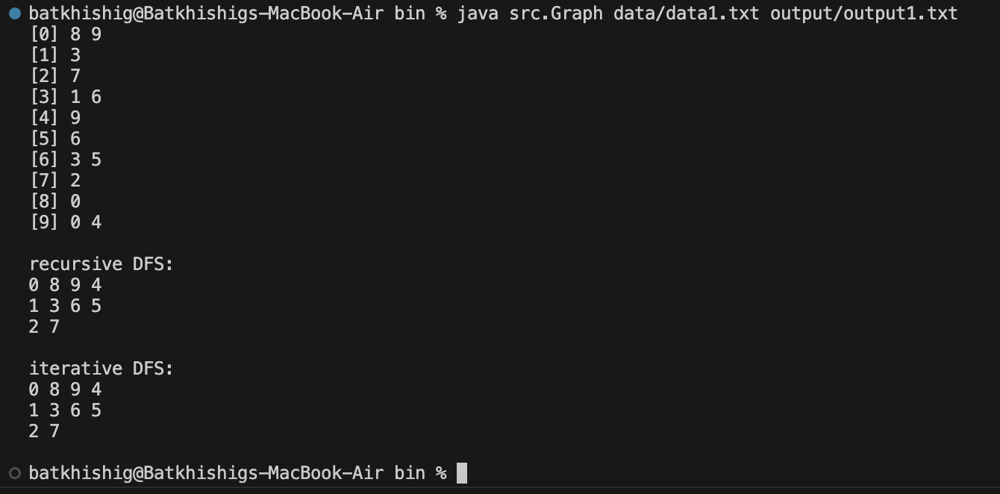

# Introduction to Algorithms - Project #1

Name: Batkhishig Dulamsurankhor

CWID: A20543498

Collaborator: None

## Project Description

The project implements a faithful iterative DFS with stack in linear time
such that

- each node enters the stack exactly once;
- the parent of a node is set once; and
- the same DFS forest and node order as the recursive DFS are returned.

You can use any language (e.g., C/C++/JAVA) to implement.
Each group may have up to three students. By the deadline, all students should upload your project
documents to blackboard including the design and analysis of the iterative algorithm, the source code,
test source data, and test output data. After that you need to schedule a demo of your project with
the TAs.

## Design and Analysis

The design of iterative DFS algorithm is similar to BFS implementation. Instead of using queue, we can use stack. First we choose an arbitrary vertex v and add its neighbors to the stack. Starting from the last entered vertex in the stack, we mark it as visited, pop it and add its neighbors to the stack, and keep doing it until we visit all the nodes. This way vertices enter the stack exactly once and we accomplish linear time O(V+E).

The only problem we have here is the order in which we traverse through the graph. If we just add the neighboring vertices in the given order, we will traverse in different order than the recursive one, therefore not "faithful". The reason is that the neighbors of the vertices entered the last will be chosen first to traverse further. But we want it in the opposite order. To solve this, we can add the neighbors in reversed order into the stack. Now, the traversal will happen just as the recursive implementation. Following is my implementation:

```java
Iterator<Integer> itr = adjacencyList.get(s).descendingIterator();
```

## Directory Structure

```bash
├── README.md                   # Document
├── bin                         # Executable binary dir
│   ├── data                    # Test cases
│   │   ├── data0.txt
│   │   ├── data1.txt
│   │   ├── data2.txt
│   │   └── data3.txt
│   ├── output                  # Test outputs
│   │   ├── output0.txt
│   │   ├── output1.txt
│   │   ├── output2.txt
│   │   └── output3.txt
│   └── src                     # Executables
│       ├── Graph.class
│       └── GraphGen.class
├── build.xml                   # Ant build instruction
└── src                         # Source code directory
    ├── Graph.java              # **DFS**
    └── GraphGen.java           # Graph generator
```

## Running the code

Used java version 17 to write, compile and run the program, and used ant to compile the source code.

### Compiling

Go to source directory and run ant command to generate java bytecodes for Graph and GraphGen.

```bash
ant
```

Go to bin folder to execute Class files.

```bash
cd bin
```

### Generating test graph

Go to source directory and run ant command to generate java bytecodes for Graph and GraphGen.

```bash
java src.GraphGen <number-of-vertices> <chances-of-edges> <file-save-dir>
```

For example:

```bash
java src.GraphGen 5 0.4 ./data/data.txt
```

### Running DFS

Program will run DFS both recursively and iteratively, and save iterative DFS's result to a file.

```bash
java src.Graph <data-input-dir> <output-save-dir>
```

For example:

```bash
java src.Graph data/data1.txt output/output1.txt
```

Example console output:


The trees in the forest will be printed in different lines, if graph is disconnected.